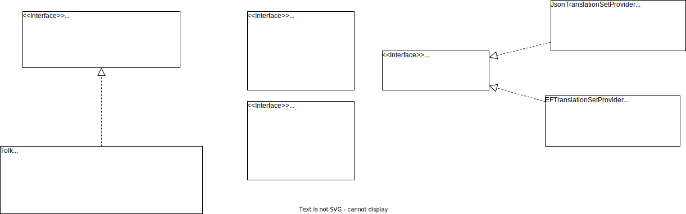

# TechTolk

Test include diagram here:




## Usage

Makkelijkst om te gebruiken:


Startup

```csharp

builder
  .AddTechTolk()
    .WithCurrentCulture()
    .WithRazorHelper()
  ...
  
app.UseTechTolk(c => {
  c.AddTranslationSet(new EFTranslationSet("connectionstring"));
  c.AddTranslationSet(new JsonTranslationSet("blabla"));
});

```

In razor

```csarp
[Inject]
public ITranslationProvider T {get;}


// bla bla, more work

@T.Translate("MyWebsite.MyAccount.EditPassword")
// (which uses some current culture provider, like Thread.CurrentCulture, if that still exists)


or

@T.Translation("MyWebsite.MyAccount.EditPassword", "nl")
```


Verder
* Prop bij class Translation of het HTML betreft of niet (trust?) Zo ja, dan zou een Razor renderer een new MvcHtmlstring uit moeten spuwen ?
* 'nl' als standaard, maar je zou 'nl-NL' kunnen overriden, want specifieker.


Oh, hier staat eigenlijk alles al ;)
https://docs.microsoft.com/en-us/aspnet/core/fundamentals/localization?view=aspnetcore-6.0
.. middlewares.. resource files...
Dat een culture een language+region is, maar dat "nl" een neutral culture is en "nl-NL" een specific culture. Wat dat betreft hebben we het bij het rechte eind om "nl" (de neutral dus) als fallback te gebruiken.

Maar goed, TechTolk wordt getarget vanaf netstandard20, dus ook te gebruiken in framework472.


* Waarom eigenlijk alles naar `string`? Je ken toch eigenlijk alles wel translate?
Alles storen als `byte[]`? Of alles bij het 'mergen' strong typed maken?
Of is een `TranslationSet` al generic typed? `TranslationSet'T`
Of juist een `TranslationEntry`? `TranslationEntry'T`
Zou een Entry is soort van ContentType moeten hebben? Dan text/html voor Html en text/plain voor platte tekst. Wellicht kun je er nog meer mee?

* En zou een `TranslationEntry` ook een `Func'T` kunnen zijn?
Per enry is lazy load niet heel handig, maar misschien per `TranslationSet` wel? Nee, per entry is ook handig.

* Standaard `.Translate(key)` returnt `string`, maar je zou 

* Culture = Segregator  (maar hoeft natuurlijk niet per ce, kan alles zijn)
CurrentCultureProvider = CurrentSegregatorProvider

* Maar uiteindelijk kan een Segregator altijd een string key zijn.

* Is dit iets met `Span'T` ? of `stackalloc` in C#7? Nee. ;-)

```csharp
public class TranslationEntry<T> : ITranslationEntry<T>
{
  public ContentType Type {get; private set; }

  private Dictionary<string, T> _d;
  
  public T Get<T>(string segregator, EntryOptions? options)
  {
    return _d[segregator];
  }
}

public class FuncEntry<T> : ITranslationEntry<T>
{
  private Func<TIn1, T> _f;

  public T Get<T>(string segregator, EntryOptions? options)
  {

  }

  public T Get<T>(string segregator, TIn1 in1)
  {

  }
}

public class EntryOptions
{
  // Some anonymous object?
  public object InputData { get; set; }

}


/*
  String interpolation?
*/

var o = new { date = DateTime.Now, name = "Fandermill" };
// of, kun je daar ook Func in kwijt?
var o = new { date = (d) => DateTime.Now.ToString("dd-MM-yyyy"), name = "Fandermill" };
// wat gebeurt er met props die niet gevuld zijn?
Func<Tin, Tout> // Func<object, string>
(object d) => $"Hello {d.name}, today is {d.date:hh-MM-YYYY}";

// Originele vertaling was dan bv "Hello {name}, today is {date}" bijvoorbeeld

Tolk.Translate("WelcomeMessage", new { date = DateTime.Now, name = "Fandermill" };
// EN dat object moet dan getransformeerd zijn naar ...
var callToTranslateDateValue = d.date;
var transformedValue = callToTranslateDateValue.ToString("formatX");
var data = new { date = transformedValu, name = n };
// Die dan uiteindelijk in de TranslationEntry als dit doet:
return $"Hello {d.name}, today is {d.date}";
```


En dus zou je een soort van parsertje kunnen maken met opties voor variabelen in een vertaling. Voor bijvoorbeeld een bepaald date format. Of misschien wel alleen strings voor 'transformations'. Bijvoorbeeld een `ValueTransformer` met key 'longdate'. We kunnen een standaard set aan ValueTransformers maken en uitbreidbaar maken voor custom implementaties.
Je kunt dan in de root van TechTolk een standaard meegeven, voor als er niets is gegeven. Misschien een cascading override van meest specifiek naar global.(Dus eerst entry, dan translation set, dan tolk).
